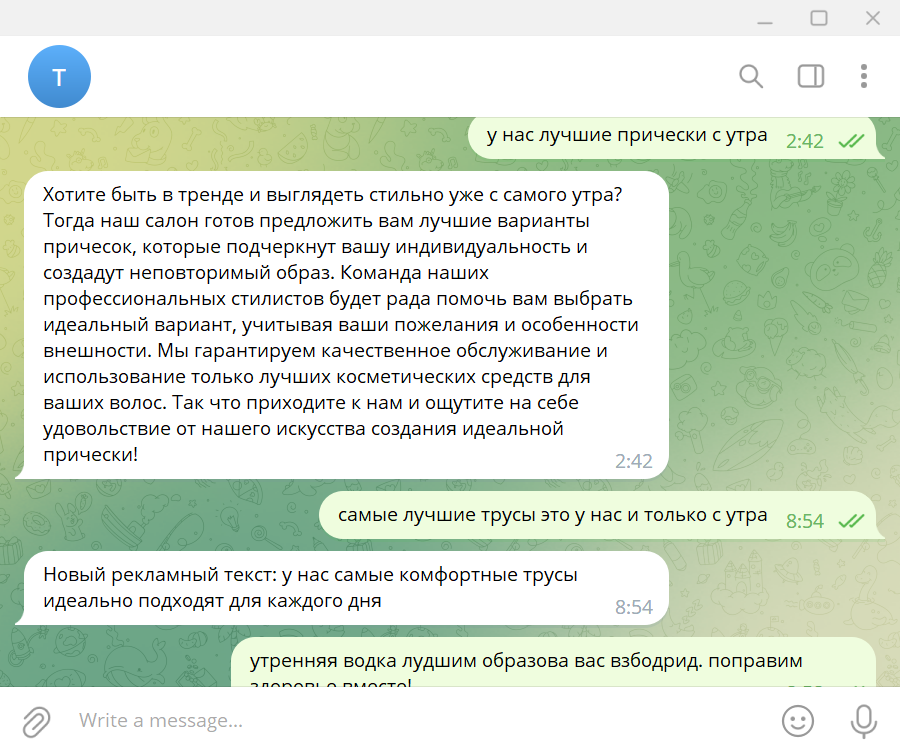

# Создание Telegram-ботов с ChatGPT
Версия для Антикафе Мансарда 

## Предварительные действия:

1. Зарегистрировать свой TG bot c помощью @BotFather и получить TOKEN.

2. Получить Open AI API_KEY

## Integration of Telegram bot and ChatGPT

## Пример для Рекламный бот Татьяна:
Бот предназначен для перефразирования рекламных текстов

Нотебук установки: 

Видео запись установки:

### Структура файла .env
TOKEN = '???'   # TG bot token

API_KEY = '???' # Open AI API Key

TATIANA_PROMPT_URL = '???' # Файл промта с инструкцией

LL_MODEL = "gpt-3.5-turbo-0613"   # Модель

