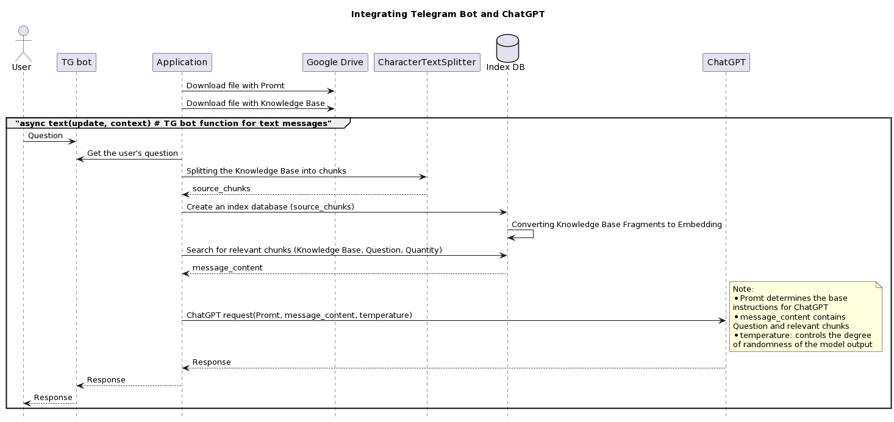

# Creating Telegram Bots with ChatGPT:

## Integration of Telegram bot and ChatGPT

### Here is an example for an Anticafe type establishment:

### How it works:

Video explanation in Russian see here:  https://youtu.be/8rKedN9tiuo

Colab notebook:

### Structure of the .env file:
TOKEN = '???'   # TG bot token

API_KEY = '???' # Open AI API Key

SYSTEM_DOC_URL = '???'          # Prompt

KNOWLEDGE_BASE_URL = '????'     # Knowledge Base

VERBOSE = 1                     # Display technical information

TEMPERATURE = 1                 # Model temperature

NUMBER_RELEVANT_CHUNKS = 5      # Number of relevant chunks

CHUNK_SIZE = 1024               # Number of tokens in a chunk

LL_MODEL = "gpt-3.5-turbo-0613" # Model

TEXT_BEGINNING = ''             # Text at the beginning

TEXT_END = ''                   # Text at the end

### Links to openai documentation:

Chat Completions API: https://platform.openai.com/docs/guides/gpt/chat-completions-api

Chat completions response format: https://platform.openai.com/docs/guides/gpt/chat-completions-response-format