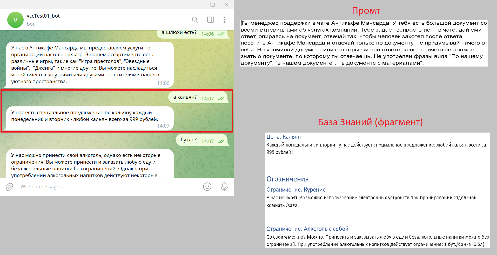

# Создание Telegram-ботов с ChatGPT
Версия для Антикафе Мансарда 

## Предварительные действия:

1. Зарегистрировать свой TG bot c помощью @BotFather и получить TOKEN.

2. Получить Open AI API_KEY

## Integration of Telegram bot and ChatGPT

## Пример для Антикафе Мансарда:

## Как это работает:

Вот видео (8 минут) https://youtu.be/NkjkqsLCweQ

Вот преза: https://docs.google.com/presentation/d/1bo9T6LvS1CXjmT60hfaM4pRDcblufdAG/edit?usp=sharing&ouid=104673724125492337414&rtpof=true&sd=true

## Минимальный комплект установки в среде Google

Выполнять эти действия в браузере Google Chrome под своим аккаунтом в Google.

Нотебук установки: 
https://drive.google.com/file/d/1-nw_ta_HZnrXAsfkJSVP50HpbanGfvRP/view?usp=sharing

Видео запись установки:
https://youtu.be/Qj_OSWLMhJg?si=RuA_iKS63P9NWta-

### Структура файла .env
TOKEN = '???'   # TG bot token

API_KEY = '???' # Open AI API Key

SYSTEM_DOC_URL = '???'          # Prompt

KNOWLEDGE_BASE_URL = '????'     # Knowledge Base

DB_DIR_NAME = "db/"             # db dir name

TEMPERATURE = 1                 # Model temperature

NUMBER_RELEVANT_CHUNKS = 5      # Number of relevant chunks

CHUNK_SIZE = 1024               # Number of tokens in a chunk

LL_MODEL = "gpt-3.5-turbo-0613" # Model

TEXT_BEGINNING = ''             # Text at the beginning

TEXT_END = ''                   # Text at the end

### Token Limit in GPT-3.5
see https://www.scriptbyai.com/token-limit-openai-chatgpt/ 

| Model| Max Tokens    |
| :-----: | :---: | 
| gpt-3.5-turbo| 4086 | 
| gpt-3.5-turbo-0613| 4086 |
| gpt-3.5-turbo-16k| 16384 |

### Links to openai documentation:

Chat Completions API: https://platform.openai.com/docs/guides/gpt/chat-completions-api

Chat completions response format: https://platform.openai.com/docs/guides/gpt/chat-completions-response-format