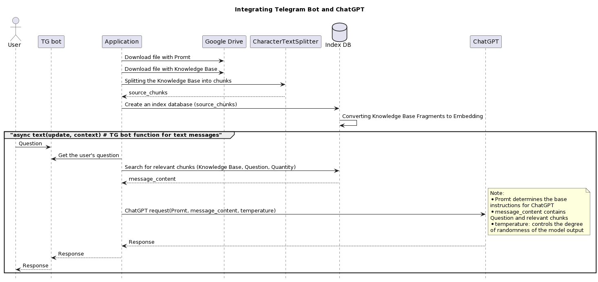

# Creating Telegram Bots with ChatGPT:

## Integration of Telegram bot and ChatGPT

### Step 1: Simple Request
Step_1_SimpleRequest.py

See: https://platform.openai.com/docs/guides/gpt/chat-completions-api

### Step 2: Knowledge base
Step_2_KnowledgeBase.py
#### Here is an example for an Anticafe type establishment:

### Step 3: TG bot and all together
Step_3_TgBot.py

#### How it works:

### Structure of the .env file:
TOKEN = '???'   # TG bot token

API_KEY = '???' # Open AI API Key

### Links to openai documentation:

Chat Completions API: https://platform.openai.com/docs/guides/gpt/chat-completions-api

Chat completions response format: https://platform.openai.com/docs/guides/gpt/chat-completions-response-format